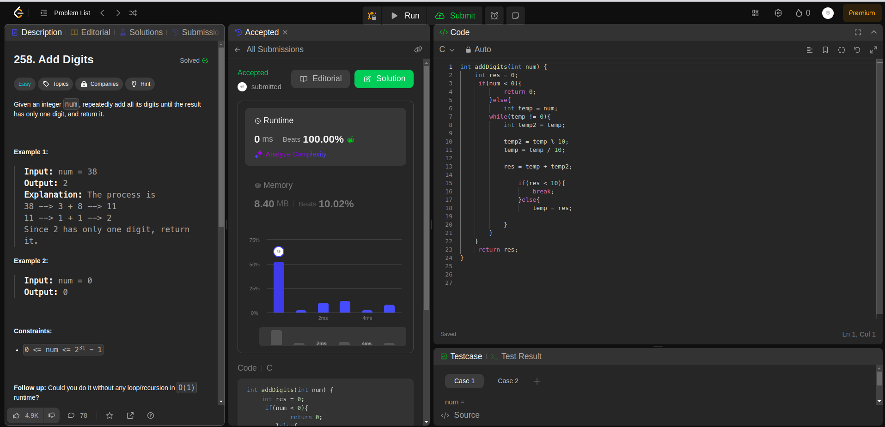

## Question

258. Add Digits

Given an integer num, repeatedly add all its digits until the result has only one digit, and return it

## Example

- Example 1:

  - Input: num = 38
  - Output: 2
  - Explanation: The process is
    38 --> 3 + 8 --> 11
    11 --> 1 + 1 --> 2
  - Since 2 has only one digit, return it.

- Example 2:

* Input: num = 0
* Output: 0

## Constraints:

0 <= num <= 231 - 1

Follow up: Could you do it without any loop/recursion in O(1) runtime?

### Rutime

<table>
  <tr>
    <th>Author</th>
    <th>Speed(ms)</th>
    <th>Memory(MB)</th>
  </tr>
    <tr>
    <td>Rio [C-solution]</td>
    <td>0</td>
    <td>8.4</td>
  </tr>
</table>

### Analysis

1. Rio [C]
   
