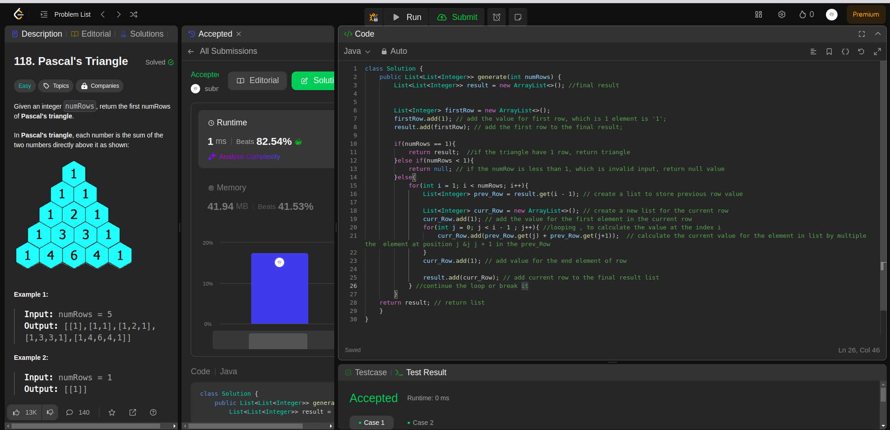

## Question
118. Pascal's Triangle

Given an integer numRows, return the first numRows of Pascal's triangle.

In Pascal's triangle, each number is the sum of the two numbers directly above it as shown:

 

## Example
- Example 1:

Input: numRows = 5
Output: [[1],[1,1],[1,2,1],[1,3,3,1],[1,4,6,4,1]]

- Example 2:

Input: numRows = 1
Output: [[1]]

## Constraints:

1 <= numRows <= 30

### Rutime
<table>
  <tr>
    <th>Author</th>
    <th>Speed(ms)</th>
    <th>Memory(MB)</th>
  </tr>
 
  <tr>
    <td>Rio</td>
    <td>1</td>
    <td>41.94</td>
  </tr>
  <tr>
    <td></td>
    <td></td>
    <td></td>
  </tr>
</table>

### Analysis
1. Rio 

