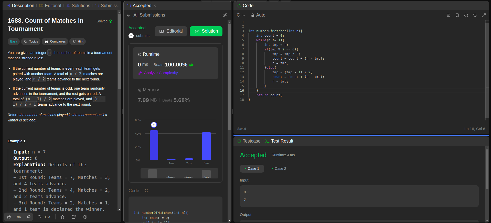

## Question

1688. Count of Matches in Tournament

You are given an integer n, the number of teams in a tournament that has strange rules:

If the current number of teams is even, each team gets paired with another team. A total of n / 2 matches are played, and n / 2 teams advance to the next round.
If the current number of teams is odd, one team randomly advances in the tournament, and the rest gets paired. A total of (n - 1) / 2 matches are played, and (n - 1) / 2 + 1 teams advance to the next round.
Return the number of matches played in the tournament until a winner is decided.

## Example

- Example 1:
  \*Input: n = 7

  \*Output: 6

  \*Explanation: Details of the tournament:

- 1st Round: Teams = 7, Matches = 3, and 4 teams advance.

- 2nd Round: Teams = 4, Matches = 2, and 2 teams advance.

- 3rd Round: Teams = 2, Matches = 1, and 1 team is declared the winner.

  Total number of matches = 3 + 2 + 1 = 6.

- Example 2:

  \*Input: n = 14

  \*Output: 13

  \*Explanation: Details of the tournament:

- 1st Round: Teams = 14, Matches = 7, and 7 teams advance.

- 2nd Round: Teams = 7, Matches = 3, and 4 teams advance.

- 3rd Round: Teams = 4, Matches = 2, and 2 teams advance.

- 4th Round: Teams = 2, Matches = 1, and 1 team is declared the winner.

  Total number of matches = 7 + 3 + 2 + 1 = 13.

## Constraints:

1 <= n <= 200

### Rutime

<table>
  <tr>
    <th>Author</th>
    <th>Speed(ms)</th>
    <th>Memory(MB)</th>
  </tr>
    <tr>
    <td>Rio</td>
    <td>0</td >
    <td>7.99</td>
  </tr>
</table>

### Analysis

1. Rio
   
