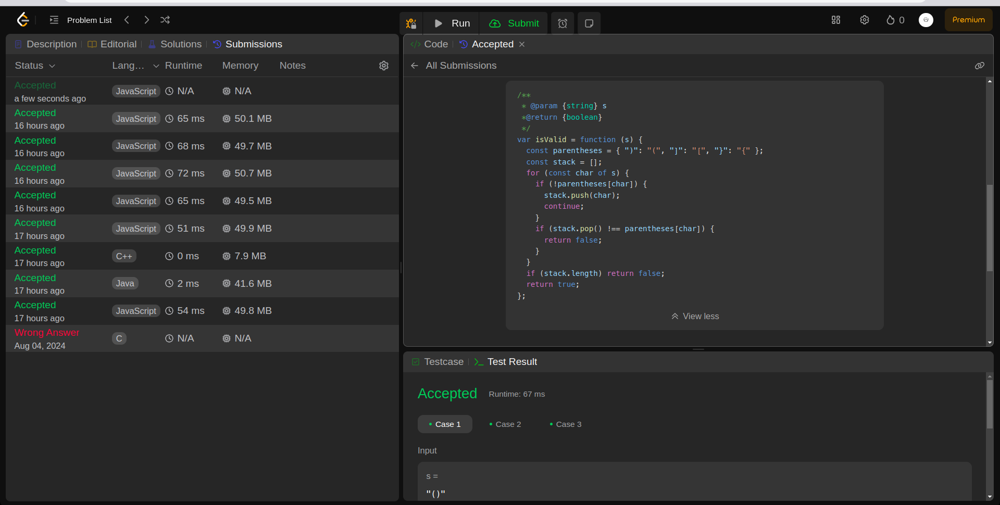
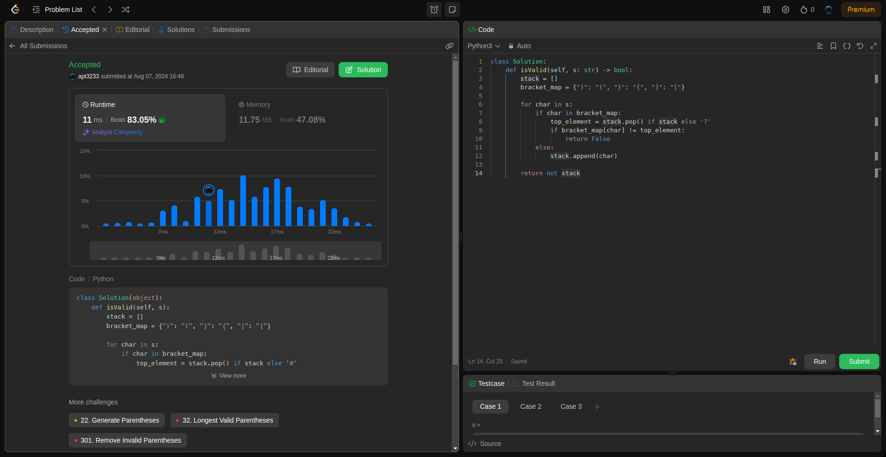
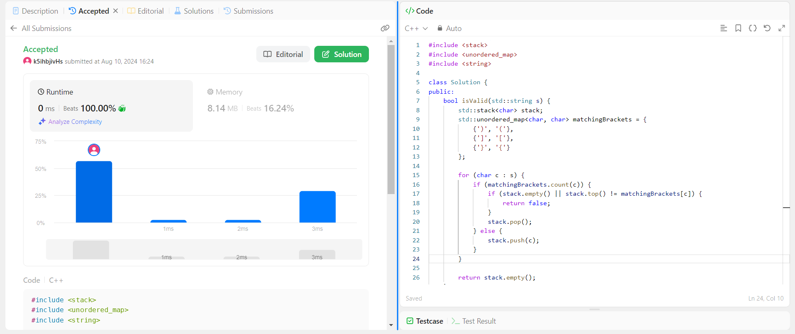

## Question

Given a string s containing just the characters '(', ')', '{', '}', '[' and ']', determine if the input string is valid.

An input string is valid if:

Open brackets must be closed by the same type of brackets.
Open brackets must be closed in the correct order.
Every close bracket has a corresponding open bracket of the same type.

## Example

Input: s = "()"
Output: true

- Example 2:

  Input: s = "()[]{}"
Output: true

Example 3:

Input: s = "(]"
Output: false

## Constraints:

    1 <= s.length <= 104
    s consists of parentheses only '()[]{}'.

### Rutime
<table>
  <tr>
    <th>Author</th>
    <th>Speed(ms)</th>
    <th>Memory(MB)</th>
  </tr>
 
  <tr>
    <td>Rio</td>
    <td>66</td>
    <td>49.78</td>
  </tr>
  <tr>
    <td>APT</td>
    <td>11</td>
    <td>11.75</td>
  </tr>
   <tr>
    <td>Dung</td>
    <td>0</td>
    <td>8.14</td>
  </tr>
</table>

### Analysis
1. Rio 

2. APT

3. Dung

