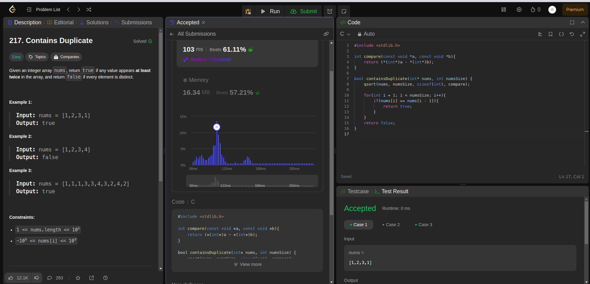

## Question

Given an integer array nums, return true if any value appears at least twice in the array, and return false if every element is distinct.

## Example

- Example 1:

    * Input: nums = [1,2,3,1]
    * Output: true
   
- Example 2:

    * Input: nums = [1,2,3,4]
    * Output: false
- Example 3:

    * Input: nums = [1,1,1,3,3,4,3,2,4,2]
    * Output: true

## Constraints:
    1 <= nums.length <= 105
   -109 <= nums[i] <= 109
### Rutime
<table>
  <tr>
    <th>Author</th>
    <th>Speed(ms)</th>
    <th>Memory(MB)</th>
  </tr>
   <tr>
    <td>Rio [java-solution]</td>
    <td>10</td >
    <td>60.52</td>
  </tr>
    <tr>
    <td>Rio [C-solution]</td>
    <td>103</td>
    <td>16.34</td>
  </tr>
</table>

### Analysis

1. Rio [java]

   *Rio [C]
