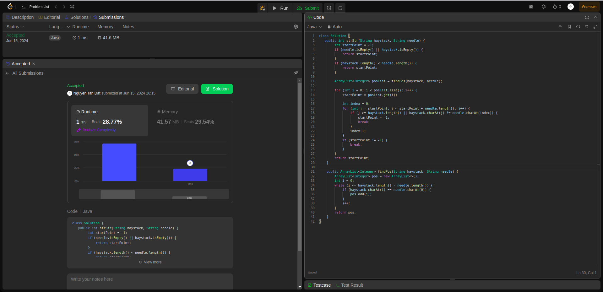

## Question
28. Find the Index of the First Occurrence in a String

Given two strings needle and haystack, return the index of the first occurrence of needle in haystack, or -1 if needle is not part of haystack.

## Example
- Example 1:

Input: haystack = "sadbutsad", needle = "sad"
Output: 0
Explanation: "sad" occurs at index 0 and 6.
The first occurrence is at index 0, so we return 0.

- Example 2:

Input: haystack = "leetcode", needle = "leeto"
Output: -1
Explanation: "leeto" did not occur in "leetcode", so we return -1.

## Constraints:

1 <= haystack.length, needle.length <= 104
haystack and needle consist of only lowercase English characters.

### Rutime
<table>
  <tr>
    <th>Author</th>
    <th>Speed(ms)</th>
    <th>Memory(MB)</th>
  </tr>
 
  <tr>
    <td>Rio</td>
    <td>1</td>
    <td>41.57</td>
  </tr>
  <tr>
    <td></td>
    <td></td>
    <td></td>
  </tr>
</table>

### Analysis
1. Rio 

