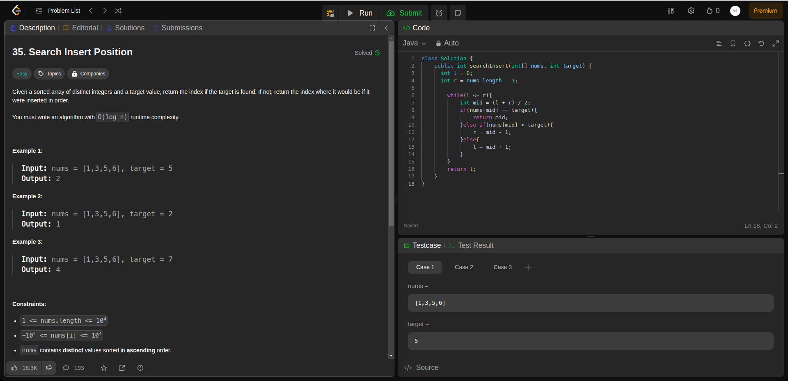

## Question
35. Search Insert Position

Given a sorted array of distinct integers and a target value, return the index if the target is found. If not, return the index where it would be if it were inserted in order.

You must write an algorithm with O(log n) runtime complexity.

## Example
- Example 1:

Input: nums = [1,3,5,6], target = 5
Output: 2

- Example 2:

Input: nums = [1,3,5,6], target = 2
Output: 1

- Example 3:

Input: nums = [1,3,5,6], target = 7
Output: 4
## Constraints:

1 <= nums.length <= 104
-104 <= nums[i] <= 104
nums contains distinct values sorted in ascending order.
-104 <= target <= 104

### Rutime
<table>
  <tr>
    <th>Author</th>
    <th>Speed(ms)</th>
    <th>Memory(MB)</th>
  </tr>
 
  <tr>
    <td>Rio</td>
    <td>0</td>
    <td>42.6</td>
  </tr>
  <tr>
    <td></td>
    <td></td>
    <td></td>
  </tr>
</table>

### Analysis
1. Rio 

