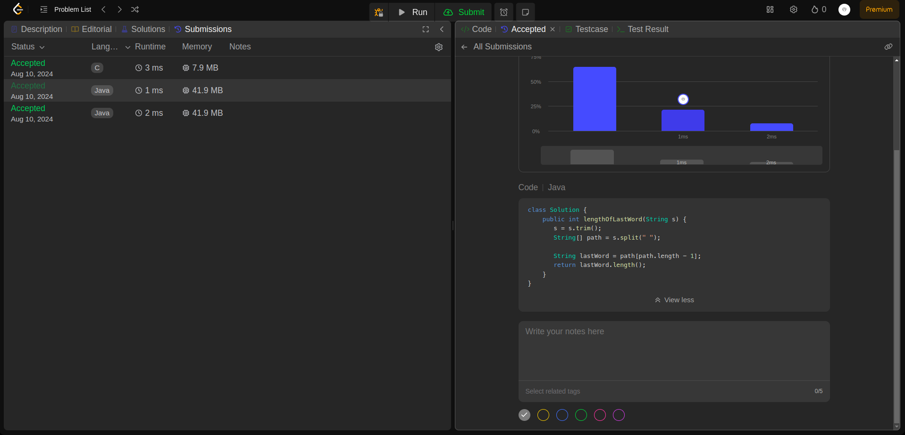

## Question
58. Length of Last Word
 
Given a string s consisting of words and spaces, return the length of the last word in the string.

A word is a maximal 
substring
 consisting of non-space characters only.
 

## Example
- Example 1:

Input: s = "Hello World"
Output: 5
Explanation: The last word is "World" with length 5.

- Example 2:

Input: s = "   fly me   to   the moon  "
Output: 4
Explanation: The last word is "moon" with length 4.

- Example 3:

Input: s = "luffy is still joyboy"
Output: 6
Explanation: The last word is "joyboy" with length 6.

## Constraints:

1 <= s.length <= 104
s consists of only English letters and spaces ' '.
There will be at least one word in s.

### Rutime
<table>
  <tr>
    <th>Author</th>
    <th>Speed(ms)</th>
    <th>Memory(MB)</th>
  </tr>
 
  <tr>
    <td>Rio</td>
    <td>3</td>
    <td>8.64</td>
  </tr>
  <tr>
    <td></td>
    <td></td>
    <td></td>
  </tr>
</table>

### Analysis
1. Rio 

