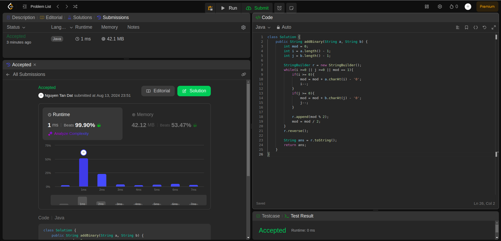

## Question
67. Add Binary

Given two binary strings a and b, return their sum as a binary string.

 

## Example
- Example 1:

Input: a = "11", b = "1"
Output: "100"

- Example 2:

Input: a = "1010", b = "1011"
Output: "10101"

## Constraints:

1 <= a.length, b.length <= 104
a and b consist only of '0' or '1' characters.
Each string does not contain leading zeros except for the zero itself.

### Rutime
<table>
  <tr>
    <th>Author</th>
    <th>Speed(ms)</th>
    <th>Memory(MB)</th>
  </tr>
 
  <tr>
    <td>Rio</td>
    <td>1</td>
    <td>42.12</td>
  </tr>
  <tr>
    <td></td>
    <td></td>
    <td></td>
  </tr>
</table>

### Analysis
1. Rio 

