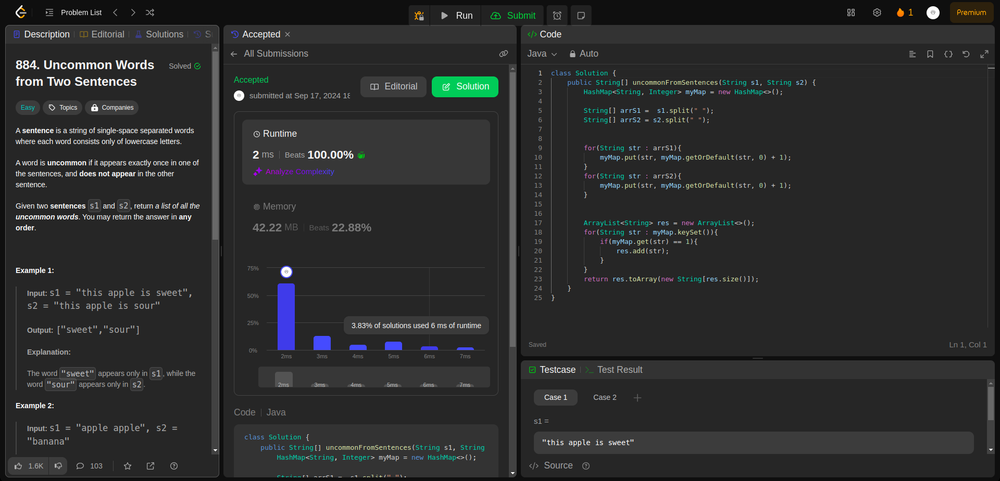

## Question

884. Uncommon Words from Two Sentences

A sentence is a string of single-space separated words where each word consists only of lowercase letters.

A word is uncommon if it appears exactly once in one of the sentences, and does not appear in the other sentence.

Given two sentences s1 and s2, return a list of all the uncommon words. You may return the answer in any order.

## Example

- Example 1:
  \*Input: s1 = "this apple is sweet", s2 = "this apple is sour"

  \*Output: ["sweet","sour"]

  Explanation:
  The word "sweet" appears only in s1, while the word "sour" appears only in s2.

- Example 2:

  \*Input: s1 = "apple apple", s2 = "banana"

  \*Output: ["banana"]

## Constraints:

Constraints:

1 <= s1.length, s2.length <= 200
s1 and s2 consist of lowercase English letters and spaces.
s1 and s2 do not have leading or trailing spaces.
All the words in s1 and s2 are separated by a single space.

### Runtime

<table>
  <tr>
    <th>Author</th>
    <th>Speed(ms)</th>
    <th>Memory(MB)</th>
  </tr>
   <tr>
    <td>Rio</td>
    <td>2</td >
    <td>42.22</td>
  </tr>
</table>

### Analysis

1. Rio [java]
   
  
