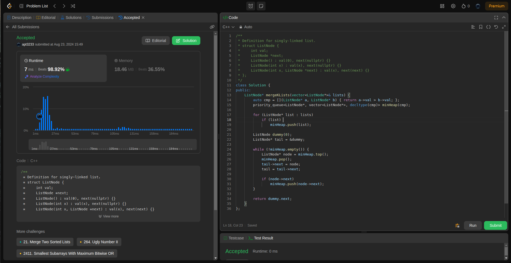
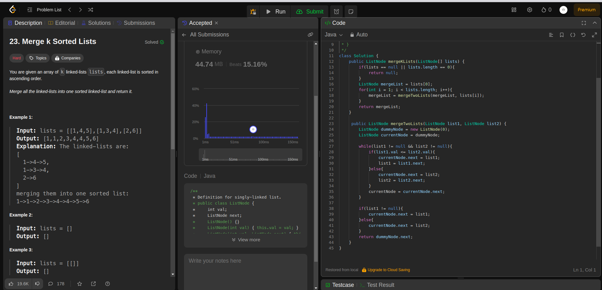

## Question

You are given an array of <code>k</code> linked-lists <code>lists</code>, each linked-list is sorted in ascending order.

Merge all the linked-lists into one sorted linked-list and return it.

## Example

- Example 1:

    * Input: lists = [[1,4,5],[1,3,4],[2,6]]
    * Output: [1,1,2,3,4,4,5,6]
    * Explanation: The linked-lists are:
    ```
    [
        1->4->5,
        1->3->4,
        2->6
    ]
    merging them into one sorted list:
        1->1->2->3->4->4->5->6
    ```
- Example 2:

    * Input: lists = []
    * Output: []
- Example 3:

    * Input: lists = [[]]
    * Output: []

## Constraints:

    k == lists.length
    0 <= k <= 104
    0 <= lists[i].length <= 500
    -104 <= lists[i][j] <= 104
    lists[i] is sorted in ascending order.
    The sum of lists[i].length will not exceed 104.

### Rutime
<table>
  <tr>
    <th>Author</th>
    <th>Speed(ms)</th>
    <th>Memory(MB)</th>
  </tr>
  <tr>
    <td>APT</td>
    <td>7</td >
    <td>18.46</td>
  </tr>
    <tr>
    <td>Rio</td>
    <td>82</td >
    <td>44.74</td>
  </tr>
</table>


### Analysis
1. APT

2. Rio

