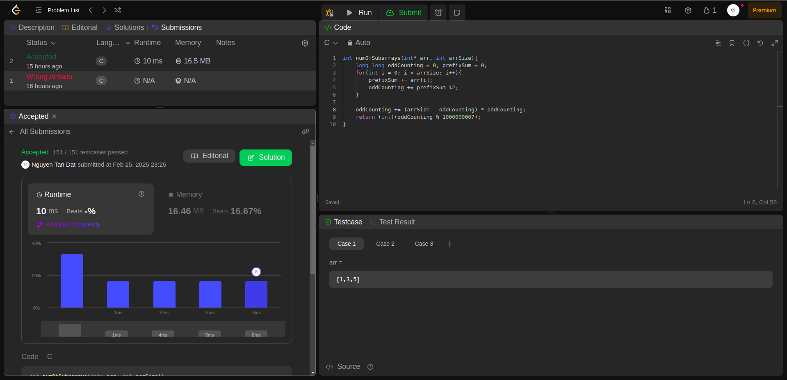

## Question

1524. Number of Sub-arrays With Odd Sum

Given an array of integers arr, return the number of subarrays with an odd sum.

Since the answer can be very large, return it modulo 109 + 7.

## Example

- Example 1:

Input: arr = [1,3,5]

Output: 4

Explanation: All subarrays are [[1],[1,3],[1,3,5],[3],[3,5],[5]]

All sub-arrays sum are [1,4,9,3,8,5].

Odd sums are [1,9,3,5] so the answer is 4.

- Example 2:

Input: arr = [2,4,6]

Output: 0

Explanation: All subarrays are [[2],[2,4],[2,4,6],[4],[4,6],[6]]

All sub-arrays sum are [2,6,12,4,10,6].

All sub-arrays have even sum and the answer is 0.

- Example 3:

Input: arr = [1,2,3,4,5,6,7]

Output: 16

## Constraints:

1 <= arr.length <= 105

1 <= arr[i] <= 100

### Rutime

<table>
  <tr>
    <th>Author</th>
    <th>Speed(ms)</th>
    <th>Memory(MB)</th>
  </tr>
  <tr>
    <td>Rio</td>
    <td>10</td >
    <td>16.46</td>
  </tr>
</table>

### Analysis

1. Rio
   
