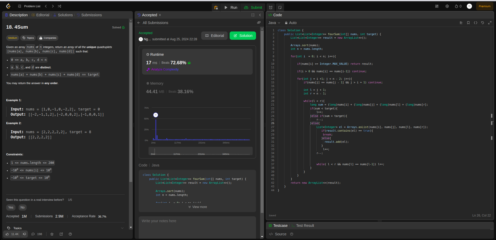

## Question

18. 4Sum

Given an array nums of n integers, return an array of all the unique quadruplets [nums[a], nums[b], nums[c], nums[d]] such that:

0 <= a, b, c, d < n

a, b, c, and d are distinct.

nums[a] + nums[b] + nums[c] + nums[d] == target

You may return the answer in any order.

## Example

- Example 1:

  \*Input: nums = [1,0,-1,0,-2,2], target = 0

  \*Output: [[-2,-1,1,2],[-2,0,0,2],[-1,0,0,1]]

- Example 2:

  \*Input: nums = [2,2,2,2,2], target = 8

  \*Output: [[2,2,2,2]]

## Constraints:

1 <= nums.length <= 200
-109 <= nums[i] <= 109
-109 <= target <= 109

### Runtime

<table>
  <tr>
    <th>Author</th>
    <th>Speed(ms)</th>
    <th>Memory(MB)</th>
  </tr>
  <tr>
    <td>Rio</td>
    <td>17</td >
    <td>44.41</td>
  </tr>
</table>

### Analysis

1. Rio
   
