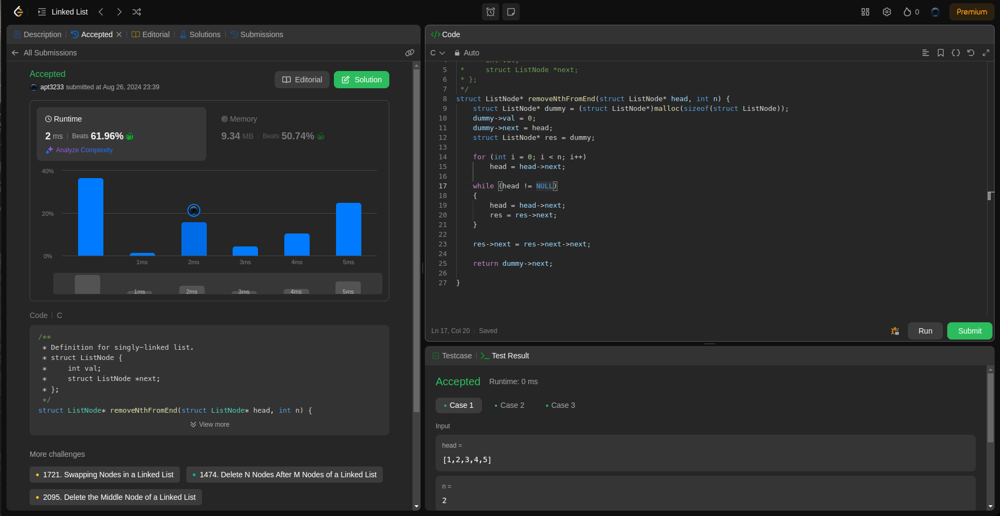

## Question

19. Remove Nth Node From End of List

Given the <code>head</code> of a linked list, remove the <code>nth</code> node from the end of the list and return its head.

Notice that the solution set must not contain duplicate triplets.

## Example

- Example 1:
Input: head = [1,2,3,4,5], n = 2
Output: [1,2,3,5]

- Example 2:
Input: head = [1], n = 1
Output: []

- Example 3:
Input: head = [1,2], n = 1
Output: [1]

## Constraints:
    The number of nodes in the list is sz.
    1 <= sz <= 30
    0 <= Node.val <= 100
    1 <= n <= sz

### Runtime

<table>
  <tr>
    <th>Author</th>
    <th>Speed(ms)</th>
    <th>Memory(MB)</th>
  </tr>
  <tr>
    <td>APT</td>
    <td>2</td >
    <td>61.96</td>
  </tr>
</table>

### Analysis

1. APT
   

