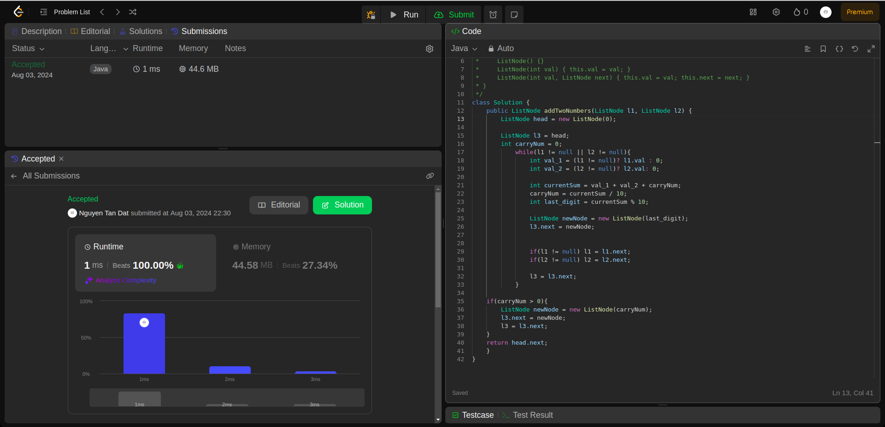
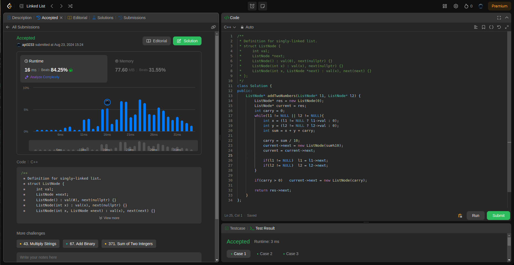

## Question

Given an array of integers <code>nums</code> and an integer <code>target</code>, return indices of the two numbers such that they add up to <code>target</code>.

You may assume that each input would have exactly one solution, and you may not use the same element twice.

You can return the answer in any order.

## Example

- Example 1:

    * Input: nums = [2,7,11,15], target = 9
    * Output: [0,1]
    * Explanation: Because nums[0] + nums[1] == 9, we return [0, 1].
- Example 2:

    * Input: nums = [3,2,4], target = 6
    * Output: [1,2]
- Example 3:

    * Input: nums = [3,3], target = 6
    * Output: [0,1]

## Constraints:

    2 <= nums.length <= 104
    -109 <= nums[i] <= 109
    -109 <= target <= 109
    Only one valid answer exists.

### Rutime
<table>
  <tr>
    <th>Author</th>
    <th>Speed(ms)</th>
    <th>Memory(MB)</th>
  </tr>
  <tr>
    <td>Rio</td>
    <td>1</td >
    <td>44.58</td>
  </tr>
  <tr>
    <td>APT</td>
    <td>16</td >
    <td>77.6</td>
  </tr>
</table>

### Analysis
1. Rio 

2. APT

