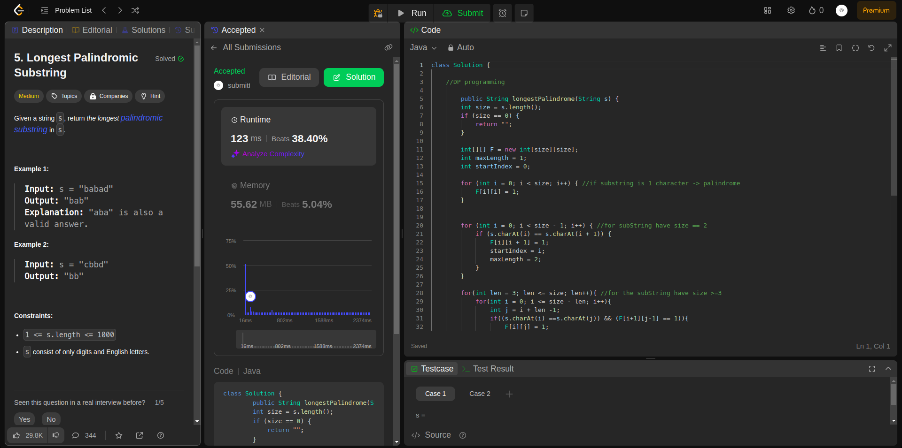

## Question
5. Longest Palindromic Substring

Given a string s, return the longest
palindromic substring in s.

## Example

- Example 1:

  \*Input: s = "babad"

  \*Output: "bab"

Explanation: "aba" is also a valid answer.

- Example 2:

  \*Input: s = "cbbd"

  \*Output: "bb"

## Constraints:

1 <= s.length <= 1000

s consist of only digits and English letters.

### Rutime

<table>
  <tr>
    <th>Author</th>
    <th>Speed(ms)</th>
    <th>Memory(MB)</th>
  </tr>
  <tr>
    <td>Rio</td>
    <td>123</td >
    <td>38.40</td>
  </tr>
</table>

### Analysis

1. Rio
   
