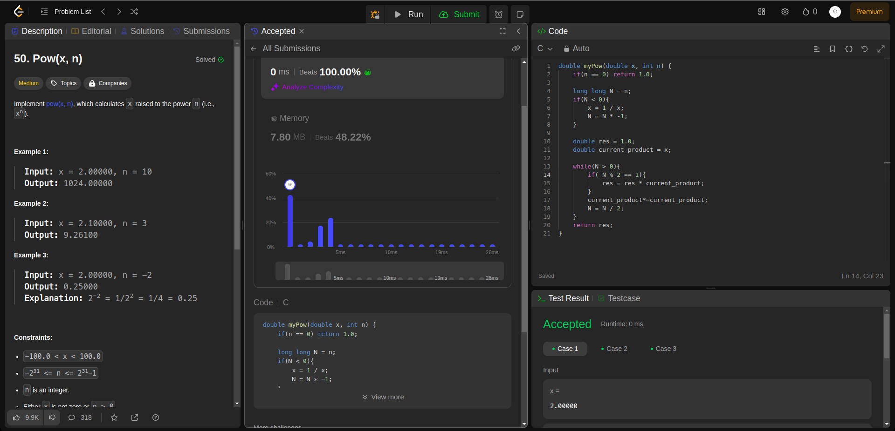

## Question

50. Pow(x, n)

Implement pow(x, n), which calculates x raised to the power n (i.e., xn).

## Example

- Example 1:

Input: x = 2.00000, n = 10
Output: 1024.00000

- Example 2:

Input: x = 2.10000, n = 3
Output: 9.26100

- Example 3:

Input: x = 2.00000, n = -2
Output: 0.25000
Explanation: 2-2 = 1/22 = 1/4 = 0.25

## Constraints:

-100.0 < x < 100.0
-231 <= n <= 231-1
n is an integer.
Either x is not zero or n > 0.
-104 <= xn <= 104

### Rutime

<table>
  <tr>
    <th>Author</th>
    <th>Speed(ms)</th>
    <th>Memory(MB)</th>
  </tr>
  <tr>
    <td>Rio</td>
    <td>0</td >
    <td>7.80</td>
  </tr>
</table>

### Analysis

1. Rio
   
