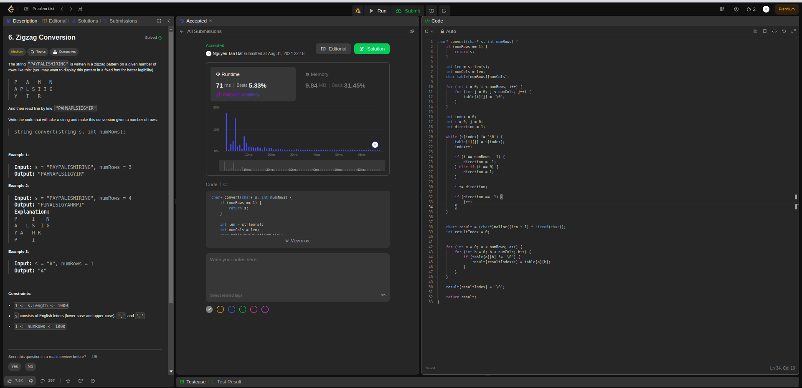

## Question
6. Zigzag Conversion

The string "PAYPALISHIRING" is written in a zigzag pattern on a given number of rows like this: (you may want to display this pattern in a fixed font for better legibility)

P      A      H     N

A   P  L   S  I  I  G

Y      I      R

And then read line by line: "PAHNAPLSIIGYIR"

Write the code that will take a string and make this conversion given a number of rows:

string convert(string s, int numRows);

## Example

- Example 1:

Input: s = "PAYPALISHIRING", numRows = 3

Output: "PAHNAPLSIIGYIR"

Output: true

Explanation: The root-to-leaf path with the target sum is shown.

- Example 2:

Input: s = "PAYPALISHIRING", numRows = 4

Output: "PINALSIGYAHRPI"

Explanation:
P I N
A L S I G
Y A H R
P I

- Example 3:

Input: s = "A", numRows = 1
Output: "A"

## Constraints:

1 <= s.length <= 1000
s consists of English letters (lower-case and upper-case), ',' and '.'.
1 <= numRows <= 1000

### Rutime

<table>
  <tr>
    <th>Author</th>
    <th>Speed(ms)</th>
    <th>Memory(MB)</th>
  </tr>
  <tr>
    <td>Rio</td>
    <td>71</td >
    <td>9.84</td>
  </tr>
</table>

### Analysis

1. Rio
   
