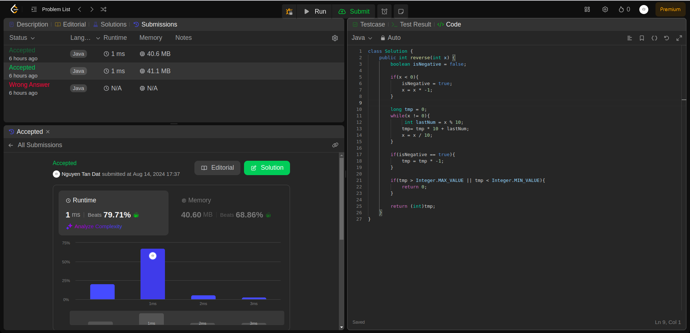

## Question

7. Reverse Integer

Given a signed 32-bit integer x, return x with its digits reversed. If reversing x causes the value to go outside the signed 32-bit integer range [-231, 231 - 1], then return 0.

Assume the environment does not allow you to store 64-bit integers (signed or unsigned).

## Example

- Example 1:

  Input: x = 123
  Output: 321

- Example 2:

  Input: x = -123
  Output: -321

- Example 3:

  Input: x = 120
  Output: 21

## Constraints:

-231 <= x <= 231 - 1

### Rutime

<table>
  <tr>
    <th>Author</th>
    <th>Speed(ms)</th>
    <th>Memory(MB)</th>
  </tr>
  <tr>
    <td>Rio</td>
    <td>1</td >
    <td>40.60</td>
  </tr>
</table>

### Analysis

1. Rio
   
